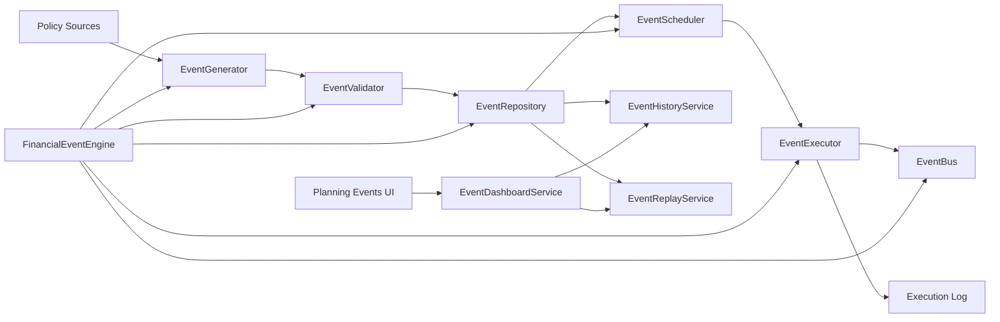

# Event Engine Architecture

## Notes

- React components consume only `EventDashboardService` APIs.
- Event computation and orchestration remain in services.
- Event execution handlers are pluggable through `EventExecutor`.
