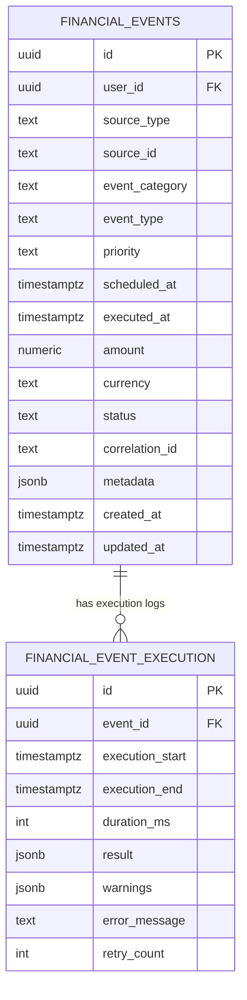

# Event Engine Database Relationship Diagram

## Key Indexes

- `financial_events_user_scheduled_idx`
- `financial_events_status_idx`
- `financial_events_category_idx`
- `financial_events_source_idx`
- `financial_events_correlation_idx`
- `financial_event_execution_event_id_idx`
