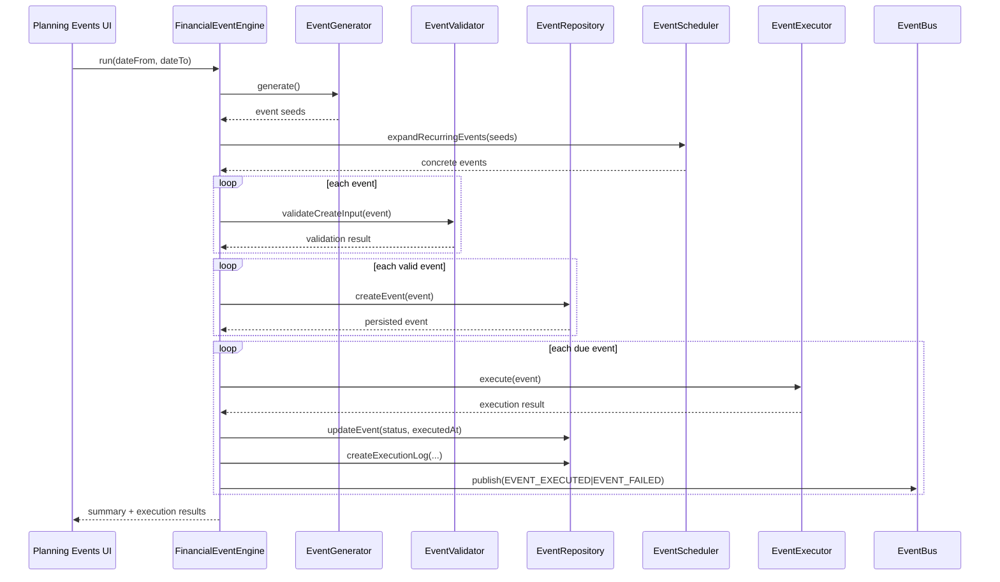

# Event Engine Sequence Diagram

```mermaid
sequenceDiagram
    participant UI as Planning Events UI
    participant Engine as FinancialEventEngine
    participant Generator as EventGenerator
    participant Validator as EventValidator
    participant Repo as EventRepository
    participant Scheduler as EventScheduler
    participant Executor as EventExecutor
    participant Bus as EventBus

    UI->>Engine: run(dateFrom, dateTo)
    Engine->>Generator: generate()
    Generator-->>Engine: event seeds
    Engine->>Scheduler: expandRecurringEvents(seeds)
    Scheduler-->>Engine: concrete events

    loop each event
      Engine->>Validator: validateCreateInput(event)
      Validator-->>Engine: validation result
    end

    loop each valid event
      Engine->>Repo: createEvent(event)
      Repo-->>Engine: persisted event
    end

    loop each due event
      Engine->>Executor: execute(event)
      Executor-->>Engine: execution result
      Engine->>Repo: updateEvent(status, executedAt)
      Engine->>Repo: createExecutionLog(...)
      Engine->>Bus: publish(EVENT_EXECUTED|EVENT_FAILED)
    end

    Engine-->>UI: summary + execution results
```
