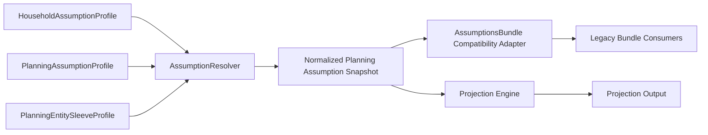
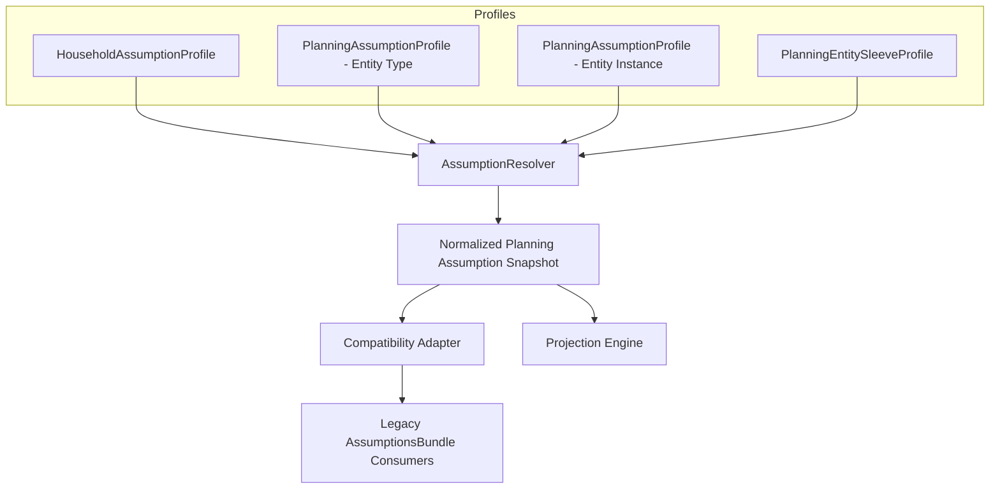

# Assumption Engine Design

## Status

This is a design-only document for Milestone M1.
It defines the target Assumption Engine architecture before any implementation work begins.
The Planning Architecture v1.0 is frozen and must not be changed by this milestone.

## Purpose

The Assumption Engine will become the sole source of assumptions consumed by the Projection Engine.
It replaces the current registry-and-bundle model with a planning-entity-owned assumption model.

The design goal is architectural alignment with Planning Architecture v1.0:
- assumptions are owned by Planning Entities, not operational holdings
- the Projection Engine consumes normalized assumption outputs only
- `AssumptionsBundle` remains only as a temporary compatibility adapter
- no projection simulation logic lives in the assumption layer

## 1. Current Implementation Review

### Current architecture summary

The current assumption stack is a legacy-to-planning bridge:

- `AssumptionRegistry` defines assumption metadata, help content, default values, and UI sections
- `AssumptionTypes` defines the assumption key universe, effective assumptions shape, registry item contract, and persistence column mapping
- `AssumptionRepository` stores and loads assumption records from Supabase tables
- `AssumptionService` resolves editor state, merges overrides, and produces effective planning assumptions
- `AssumptionService` also maps effective planning assumptions into the legacy `AssumptionsBundle`
- the Projection Engine and other downstream services still consume `AssumptionsBundle`

### Current coupling points

The current model still carries legacy assumptions through a compatibility-first design:

- assumption categories are grouped by legacy planning topics such as PERSONAL, INCOME, INFLATION, INVESTMENTS, LOANS, TAXES, and RETIREMENT
- the legacy bundle adapter maps planning assumptions into aggregate fields like `expectedReturnRate`, `fixedDepositRate`, `realEstateAppreciationRate`, and `averageInterestRate`
- multiple consumers still ask for `AssumptionsBundle` instead of a planning-native assumption profile

### Existing consumers of `AssumptionsBundle`

The bundle is currently consumed by:

- [src/services/projection/ProjectionContext.ts](../../src/services/projection/ProjectionContext.ts)
- [src/services/projection/ContributionProcessor.ts](../../src/services/projection/ContributionProcessor.ts)
- [src/services/projection/GrowthProcessor.ts](../../src/services/projection/GrowthProcessor.ts)
- [src/services/scenarios/PlanningScenarioService.ts](../../src/services/planning/scenarios/PlanningScenarioService.ts)
- [src/services/simulation/FinancialSimulationEngine.ts](../../src/services/simulation/FinancialSimulationEngine.ts)
- [src/services/simulation/SimulationTypes.ts](../../src/services/simulation/SimulationTypes.ts)
- [src/services/projection/ProjectionInputService.ts](../../src/services/projection/ProjectionInputService.ts)
- [src/services/planning/goals/GoalService.ts](../../src/services/planning/goals/GoalService.ts)
- [src/types/planningScenario.ts](../../src/types/planningScenario.ts)

These consumers must remain stable during migration, but they must eventually stop being the primary assumption source.

## 2. Target Assumption Engine

### Target architecture summary

The target engine replaces category-based assumptions with planning-entity-owned assumption profiles.

### Required components

- `PlanningAssumptionProfile`
- `HouseholdAssumptionProfile`
- `PlanningEntitySleeveProfile` for sub-entity sleeves such as NPS equity and debt
- `AssumptionResolver`
- compatibility adapter for the legacy `AssumptionsBundle`

### Component relationships

### Component responsibilities

#### HouseholdAssumptionProfile

Owns cross-cutting assumptions that are not specific to any single planning entity.

Examples:
- currentAge
- retirementAge
- lifeExpectancy
- spouseLifeExpectancy
- salary and income growth assumptions
- inflation assumptions
- tax assumptions
- retirement drawdown assumptions
- emergency corpus assumptions
- goal funding priority defaults

#### PlanningAssumptionProfile

Owns the assumption profile for a planning entity.

Examples:
- Cash / Bank Accounts profile
- Mutual Funds profile
- Stocks profile
- Fixed Deposits profile
- Gold profile
- Silver profile
- Real Estate profile
- EPF profile
- PPF profile
- NPS profile
- Other Assets profile
- Home Loan profile
- Car Loan profile
- Personal Loan profile
- Education Loan profile
- Loan Against Property profile
- Credit Cards profile
- Bank Overdraft profile
- Other Liabilities profile

A planning entity may have:
- entity-level defaults
- inherited household defaults
- overridden values at the entity instance level

#### PlanningEntitySleeveProfile

Owns a sub-entity assumption profile used when one planning entity requires multiple internal sleeves.

The initial target use case is NPS:
- NPS equity sleeve
- NPS debt sleeve

The sleeve profile exists so entity-level ownership stays intact while allowing finer-grained assumptions where the entity requires them.

#### AssumptionResolver

Resolves the effective assumption set for a planning entity instance.

Responsibilities:
- resolve inheritance across instance, entity type, household, and system defaults
- merge sleeve assumptions where needed
- produce a normalized snapshot for the Projection Engine
- produce a legacy bundle view for compatibility consumers

The resolver is the only component allowed to assemble effective assumptions for runtime use.

#### Compatibility Adapter

Translates the planning-native assumption snapshot into the legacy `AssumptionsBundle` shape.

This adapter exists only during migration.
It preserves downstream compatibility while the projection stack is gradually re-wired to the new engine.

## 3. Ownership Model

### Ownership rules

Every Planning Entity owns an assumption profile.

Ownership means:
- the entity is the semantic home for its assumptions
- the entity can override household defaults
- the entity can inherit default values from its type profile
- the entity can expose sleeve profiles if needed

### Ownership table

| Planning Entity | Owner | Assumption Profile | Inherited Defaults | Overridden Assumptions |
|---|---|---|---|---|
| Cash / Bank Accounts | Cash / Bank Accounts | PlanningAssumptionProfile | Household cash and liquidity defaults | cashReturn |
| Mutual Funds | Mutual Funds | PlanningAssumptionProfile | Household asset-return defaults | equityReturn |
| Stocks | Stocks | PlanningAssumptionProfile | Household asset-return defaults | equityReturn |
| Fixed Deposits | Fixed Deposits | PlanningAssumptionProfile | Household debt-return defaults | debtReturn |
| Gold | Gold | PlanningAssumptionProfile | Household asset-return defaults | goldReturn |
| Silver | Silver | PlanningAssumptionProfile | Household asset-return defaults | silverReturn |
| Real Estate | Real Estate | PlanningAssumptionProfile | Household asset-return defaults | realEstateReturn |
| EPF | EPF | PlanningAssumptionProfile | Household retirement defaults | epfReturn |
| PPF | PPF | PlanningAssumptionProfile | Household retirement defaults | ppfReturn |
| NPS | NPS | PlanningAssumptionProfile + PlanningEntitySleeveProfile | Household retirement defaults | npsEquityReturn, npsDebtReturn |
| Other Assets | Other Assets | PlanningAssumptionProfile | Household residual asset defaults | no direct return assumption in v1; inherits residual defaults only |
| Home Loan | Home Loan | PlanningAssumptionProfile | Household debt-cost defaults | homeLoanInterest, loanPrepaymentStrategy |
| Car Loan | Car Loan | PlanningAssumptionProfile | Household debt-cost defaults | carLoanInterest, loanPrepaymentStrategy |
| Personal Loan | Personal Loan | PlanningAssumptionProfile | Household debt-cost defaults | personalLoanInterest, loanPrepaymentStrategy |
| Education Loan | Education Loan | PlanningAssumptionProfile | Household debt-cost defaults | inherited personal-loan-style default in v1, future dedicated interest key possible |
| Loan Against Property | Loan Against Property | PlanningAssumptionProfile | Household debt-cost defaults | inherited home-loan-style default in v1, future dedicated interest key possible |
| Credit Cards | Credit Cards | PlanningAssumptionProfile | Household debt-cost defaults | inherited personal-loan-style default in v1, future revolving-credit key possible |
| Bank Overdraft | Bank Overdraft | PlanningAssumptionProfile | Household debt-cost defaults | inherited personal-loan-style default in v1, future overdraft key possible |
| Other Liabilities | Other Liabilities | PlanningAssumptionProfile | Household debt-cost defaults | residual debt defaults only |

### Notes on ownership semantics

- Ownership is semantic, not storage-specific.
- The profile can be instantiated per entity instance if a future workflow needs account-level tuning.
- For v1, many entities will likely use a single entity-type profile plus optional overrides.
- The model must still support entity-instance overrides because Planning Architecture v1.0 allows planning entities to be future scenario participants rather than just bucket names.

## 4. Inheritance Model

### Lookup order

The resolver must use the following order:

1. Entity Instance
2. Entity Type
3. Household
4. System Default

### How inheritance works

The resolver evaluates each assumption key from the most specific scope to the most general scope.

Example flow:
- if an entity instance override exists, use it
- otherwise if the entity type profile defines the assumption, use it
- otherwise if the household profile defines the assumption, use it
- otherwise use the system default

Inheritance should be deterministic and explainable.
The provenance of each resolved assumption must be preserved so the UI and debugging tools can show why a value was chosen.

### Recommended provenance data

Every resolved assumption should carry:
- value
- source scope
- source type
- inheritance depth
- overridden flag
- optional notes for compatibility mappings

## 5. Target Assumption Model

### HouseholdAssumptionProfile

Contains assumptions that are shared across the household planning context.

Suggested keys:
- currentAge
- retirementAge
- lifeExpectancy
- spouseLifeExpectancy
- salaryGrowthRate
- bonusGrowthRate
- businessIncomeGrowth
- rentalIncomeGrowth
- otherIncomeGrowth
- generalInflation
- medicalInflation
- educationInflation
- lifestyleInflation
- propertyInflation
- luxuryInflation
- incomeTaxRate
- capitalGainsTax
- dividendTax
- rentalTaxRate
- withdrawalRate
- retirementExpenseRatio
- legacyTarget
- emergencyCorpusMonths
- goalFundingPriority

### PlanningAssumptionProfile

Contains entity-owned assumptions that drive entity behavior.

Suggested entity-owned keys by entity:
- Cash / Bank Accounts: cashReturn
- Mutual Funds: equityReturn
- Stocks: equityReturn
- Fixed Deposits: debtReturn
- Gold: goldReturn
- Silver: silverReturn
- Real Estate: realEstateReturn
- EPF: epfReturn
- PPF: ppfReturn
- NPS: npsEquityReturn, npsDebtReturn
- Other Assets: residual asset defaults only, no direct v1 assumption key
- Home Loan: homeLoanInterest, loanPrepaymentStrategy
- Car Loan: carLoanInterest, loanPrepaymentStrategy
- Personal Loan: personalLoanInterest, loanPrepaymentStrategy
- Education Loan: inherited personal-loan-style debt default in v1
- Loan Against Property: inherited home-loan-style debt default in v1
- Credit Cards: inherited personal-loan-style debt default in v1
- Bank Overdraft: inherited personal-loan-style debt default in v1
- Other Liabilities: residual debt defaults only

### PlanningEntitySleeveProfile

Contains subordinate assumptions for entities that need internal segmentation.

Initial scope:
- NPS equity sleeve
- NPS debt sleeve

Future candidates:
- hybrid debt products
- structured asset sleeves
- multi-rate retirement products

## 6. Assumption Registry Redesign

### Registry role in the target model

The registry should stop being a category bucket list and become an ownership map.

The registry should answer:
- which entity owns this assumption
- whether it belongs to household or entity scope
- whether it is a sleeve assumption
- whether it is a compatibility-only legacy key

### Registry metadata additions

Each registry item should eventually carry:
- owner scope: Household, EntityType, EntityInstance, Sleeve
- owner entity key or entity type
- inheritance eligibility
- compatibility bundle mapping information
- deprecation status if the assumption is legacy-only

### Registry grouping recommendation

Keep the UI grouping if needed, but separate it from model ownership.
For example:
- UI category: Investments
- model owner: Mutual Funds, Stocks, Gold, Real Estate, etc.

This prevents the UI taxonomy from reintroducing the old architecture boundary.

## 7. Compatibility With AssumptionsBundle

### Compatibility principle

`AssumptionsBundle` remains a temporary compatibility adapter only.
It must not become the canonical assumption source again.

### Adapter responsibilities

The adapter should:
- accept a normalized planning assumption snapshot
- flatten it into the legacy bundle shape
- preserve current consumer behavior during migration
- provide best-effort legacy values where the bundle is less expressive than the new model

### Legacy mapping strategy

Household-owned assumptions map directly to the legacy bundle fields.

Entity-owned assumptions are flattened as follows:
- Mutual Funds and Stocks contribute to the legacy investment return field
- Fixed Deposits contribute to the legacy debt return field
- Gold contributes to gold appreciation
- Real Estate contributes to real estate appreciation
- Home Loan and similar liability entities contribute to the legacy loan interest field where compatible
- NPS sleeves map to the existing NPS-related fields

### Important compatibility rule

The adapter may lose fidelity.
That is acceptable only during migration.
The Projection Engine should stop depending on the adapter as soon as the new path is ready.

## 8. Relationship Diagram

## 9. Migration Plan

### Phase 1: Introduce PlanningAssumptionProfile

Goals:
- define the new profile model and ownership metadata
- add household and entity-profile shape definitions
- keep the current bundle and registry behavior intact

Success criteria:
- new model exists in parallel
- no runtime consumer changes yet
- ownership mapping is documented and testable

### Phase 2: Implement AssumptionResolver

Goals:
- resolve entity, household, and system defaults
- produce normalized planning assumptions
- generate provenance for debugging and UI visibility

Success criteria:
- resolver can compute a complete planning snapshot
- compatibility adapter can flatten the resolver output
- current bundle consumers still function

### Phase 3: Wire Projection Engine

Goals:
- switch the Projection Engine to consume resolved planning assumptions
- keep `AssumptionsBundle` only for legacy fallbacks and non-engine consumers

Success criteria:
- engine reads planning-native assumptions
- bundle no longer drives projection logic
- tests prove no behavior regression in projection outputs

### Phase 4: Remove Legacy Adapter

Goals:
- eliminate `AssumptionsBundle` from runtime projection paths
- retire unused legacy flattening logic
- simplify assumption storage and resolution

Success criteria:
- projection consumes planning-native assumptions only
- legacy adapter remains only if any unrelated consumer still requires it
- model ownership is fully planning-entity based

## 10. Risks

### Architectural risks

- The new model may drift back toward category-based ownership if the registry is not redesigned to encode entity ownership explicitly.
- Entity-instance and entity-type ownership can become ambiguous if registry precedence is not strict.
- The compatibility adapter can become a second source of truth if it grows beyond a temporary flattening layer.

### Backward compatibility risks

- Current consumers expect a flat `AssumptionsBundle` and may break if the adapter shape changes too early.
- Legacy fields may not express the full fidelity of entity-owned assumptions, especially for NPS sleeves and liability-specific behavior.
- Scenario presets and saved overrides may need migration if keys are renamed or regrouped.

### Migration risks

- Moving from category ownership to entity ownership can invalidate existing assumptions if mapping rules are incomplete.
- The resolver may produce different values than the current bundle adapter if inheritance precedence is implemented incorrectly.
- Household defaults may unintentionally override entity-specific defaults if precedence is not enforced consistently.

### Testing requirements

- Unit tests for entity, household, sleeve, and system-default inheritance.
- Unit tests for the compatibility adapter flattening rules.
- Snapshot tests for provenance output.
- Regression tests proving Projection Engine output remains unchanged during the migration phases.
- Migration tests for existing saved assumptions and scenarios.

## 11. Open Design Rules

These rules should remain stable unless an ADR revises them:

1. Planning entities own assumptions.
2. Household assumptions remain separate from entity assumptions.
3. NPS uses a sleeve profile where sub-allocation matters.
4. `AssumptionsBundle` is compatibility-only.
5. The Projection Engine must consume assumption output, not raw registry data.
6. Ownership must be explicit and explainable.
7. Future changes must update this document and create a new ADR rather than silently changing the design.

## 12. Summary

This design re-centers the Assumption Engine around Planning Architecture v1.0.
It replaces category-driven assumptions with ownership-driven planning profiles, keeps the legacy bundle as a migration adapter, and preserves the Projection Engine boundary as a consumer of normalized assumptions only.

No implementation work is defined by this document.
It is the approved target design for review before coding begins.
