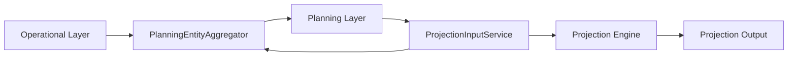

# Planning Model Architecture v1.0

## Purpose

This document is the canonical reference for WealthOS planning-model behavior.
It defines the boundary between operational data, planning abstractions, projection input normalization, and the projection engine.
Future architectural changes must update this document and add a new ADR rather than silently changing the design.

The intent is architectural separation:
- the Operational Layer stores real-world financial facts
- the Planning Layer groups those facts into planning entities
- the PlanningEntityAggregator converts operational holdings into planning entities
- the ProjectionInputService selects the opening source and normalizes state
- the Projection Engine consumes only the normalized planning state

## Layer Diagram

## Operational Layer

The Operational Layer is the source of truth for actual records. It contains the detailed domain objects that users create and maintain.

Typical operational objects include:
- Bank accounts
- Assets
- Investments
- Fixed deposits
- Gold holdings
- Silver holdings
- Real estate properties
- Retirement accounts
- Liabilities
- Insurance accounts

Operational records remain granular and domain-specific. They are not projection entities. The engine must not depend on operational record shapes or individual holdings.

## Planning Layer

The Planning Layer is the normalized representation used for projection and scenario modeling.

It groups operational holdings into a smaller set of planning entities such as:
- Cash / Bank Accounts
- Mutual Funds
- Stocks
- Fixed Deposits
- Gold
- Silver
- EPF
- PPF
- NPS
- Real Estate
- Other Assets
- First-class liability entities such as Home Loan, Car Loan, Personal Loan, Education Loan, Loan Against Property, Credit Card, Bank Overdraft, and Other Liabilities

Planning entities are aggregate buckets. They intentionally hide the operational detail that produced them.

## PlanningEntityAggregator

`PlanningEntityAggregator` is the transformation service that converts operational holdings into planning entities.

Responsibilities:
- load or receive operational holdings in a service-friendly shape
- aggregate live operational data into planning buckets
- aggregate month-end close values into planning buckets
- normalize manual opening balances into a valid planning state
- round numeric values consistently
- keep the aggregation rules reusable and independent from the engine

The aggregator is the only place where asset-class and liability-class bucket rules should live.

### Aggregate Entry Points

- `aggregateFromLiveData(data)`
- `aggregateFromMonthEndClose(values)`
- `normalizeProjectionState(state)`

### Design Constraints

- The aggregator may know operational record shapes.
- The aggregator may know bucket rules and naming.
- The aggregator must not perform projection simulation.
- The aggregator must not read scenario assumptions directly.
- The aggregator must not depend on downstream projection steps.

## ProjectionInputService

`ProjectionInputService` is the orchestration boundary between the record layer and the projection engine.

Responsibilities:
- load operational data needed for projection startup
- choose the opening source based on `ProjectionStartSource`
- resolve live-balance-sheet, latest closed month-end, specific closed month-end, or manual opening balances
- delegate aggregation to `PlanningEntityAggregator`
- construct the final `ProjectionContext`

The input service should not contain asset-class aggregation logic. It should orchestrate data loading and pass inputs to the aggregator.

### Opening Source Rules

- `live-balance-sheet` uses live operational holdings through the aggregator
- `latest-closed-month-end` uses the most recent closed snapshot if one exists, otherwise falls back to live data
- `specific-closed-month-end` uses the selected closed snapshot
- `manual-opening-balances` clones and normalizes the provided planning state

## Projection Engine

The Projection Engine consumes the normalized `ProjectionContext` and runs month-by-month simulation.

Responsibilities:
- build the projection timeline
- execute monthly planning steps
- roll forward state
- generate ledger records and output curves
- remain generic over planning entities

The engine should not know how operational holdings are stored.
It should only operate on the normalized planning state and entity buckets that arrive through the input service.

## Mapping Rules

### Assets

Operational asset records map into planning buckets as follows:

- `cash`, `checking`, `savings` bank-style assets and active bank balances map to Cash / Bank Accounts
- `investment` asset records contribute to the broader investment total only when they are used as legacy inputs
- `real_estate` asset records contribute to Real Estate when no dedicated property record supersedes them
- `vehicle`, `business`, and `other` asset types map to Other Assets
- investments that do not match a supported named investment class also map to Other Assets in the planning layer

### Investments

Operational investment categories map into planning entities as follows:

- Mutual Funds -> Mutual Funds
- Stocks and ETFs -> Stocks
- Fixed Deposits -> Fixed Deposits
- Gold and Sovereign Gold Bonds -> Gold
- Silver -> Silver
- EPF -> EPF
- PPF -> PPF
- NPS -> NPS
- Any uncategorized or non-core investment category -> Other Assets

The planning model intentionally avoids a separate "Other Investments" bucket. Unclassified investment value belongs under Other Assets.

### Retirement Accounts

Retirement accounts map directly to planning entities:

- EPF -> EPF
- PPF -> PPF
- NPS -> NPS

When both retirement-account records and investment records exist for the same retirement class, the aggregator sums them into the same planning bucket.

### Bank Accounts

Active bank accounts contribute to Cash / Bank Accounts.
Closed bank accounts are excluded from live aggregation.

### Fixed Deposits

Fixed deposits contribute to the Fixed Deposits planning entity.
Legacy fixed-deposit investment rows are folded into the same bucket as dedicated fixed deposit records.

### Gold and Silver

- Gold holdings and gold-related investment categories map to Gold
- Silver holdings and silver investment categories map to Silver

### Real Estate

Dedicated real-estate properties map to Real Estate.
Legacy real-estate asset rows may also contribute to the same bucket for continuity.

### Liabilities

Liabilities are first-class planning entities.
They are not collapsed into Other Investment.

Current liability mapping rules:

- Home Loan -> HomeLoan
- Car Loan -> CarLoan
- Personal Loan -> PersonalLoan
- Education Loan -> EducationLoan
- Loan Against Property -> LoanAgainstProperty
- Credit Card -> CreditCard
- Overdraft / Line of Credit -> BankOverdraft
- Other Liability -> OtherLiability

Liability values are aggregated from operational liability records and kept separate from assets.

## Month-End Close Normalization

Month-end close data is stored as coarse aggregate item keys rather than per-holding records.
The close layer preserves these buckets:
- bank_accounts
- mutual_funds
- stocks
- gold
- silver
- fixed_deposits
- epf
- ppf
- nps
- real_estate
- other_assets
- home_loans
- car_loans
- other_liabilities

Normalization rules:
- `bank_accounts` becomes Cash / Bank Accounts
- `mutual_funds` becomes Mutual Funds
- `stocks` becomes Stocks
- `gold` becomes Gold
- `silver` becomes Silver
- `fixed_deposits` becomes Fixed Deposits
- `epf`, `ppf`, and `nps` become their matching retirement buckets
- `real_estate` becomes Real Estate
- `other_assets` becomes Other Assets
- `home_loans` becomes Home Loan liabilities
- `car_loans` becomes Car Loan liabilities
- `other_liabilities` becomes Other Liabilities

The month-end-close layer is therefore a compatible input source for the planning layer, not a separate modeling system.

## Manual Opening Balance Normalization

Manual opening balances are normalized into a valid planning state.

Rules:
- existing projection entities are preserved and cloned if they are already present
- if projection entities are missing, aggregate placeholder buckets are synthesized from scalar totals
- cash becomes Cash / Bank Accounts
- investments become Planning Investments
- assets become Other Assets
- liabilities become Planning Liabilities
- retirement corpus becomes Retirement Corpus
- if all totals are zero, a zero-value investments placeholder is still created so the state remains structurally valid

Manual balances are treated as planning input, not as raw operational data.

## Canonical Boundary Rules

1. The Operational Layer owns facts.
2. The Planning Layer owns normalized buckets.
3. `PlanningEntityAggregator` owns aggregation rules.
4. `ProjectionInputService` owns source selection and orchestration.
5. The Projection Engine owns simulation only.
6. New asset classes should be added by extending the planning mapping rules, not by embedding logic in the engine.
7. New liability classes should be represented as first-class planning entities before any engine changes are considered.
8. Any architectural change must update this document and introduce a new ADR.

## Development Rule

Before implementing new projection logic, update this document if the data-flow boundary or mapping rules change.
If this document and the code diverge, treat this document as the architectural contract to reconcile against.
